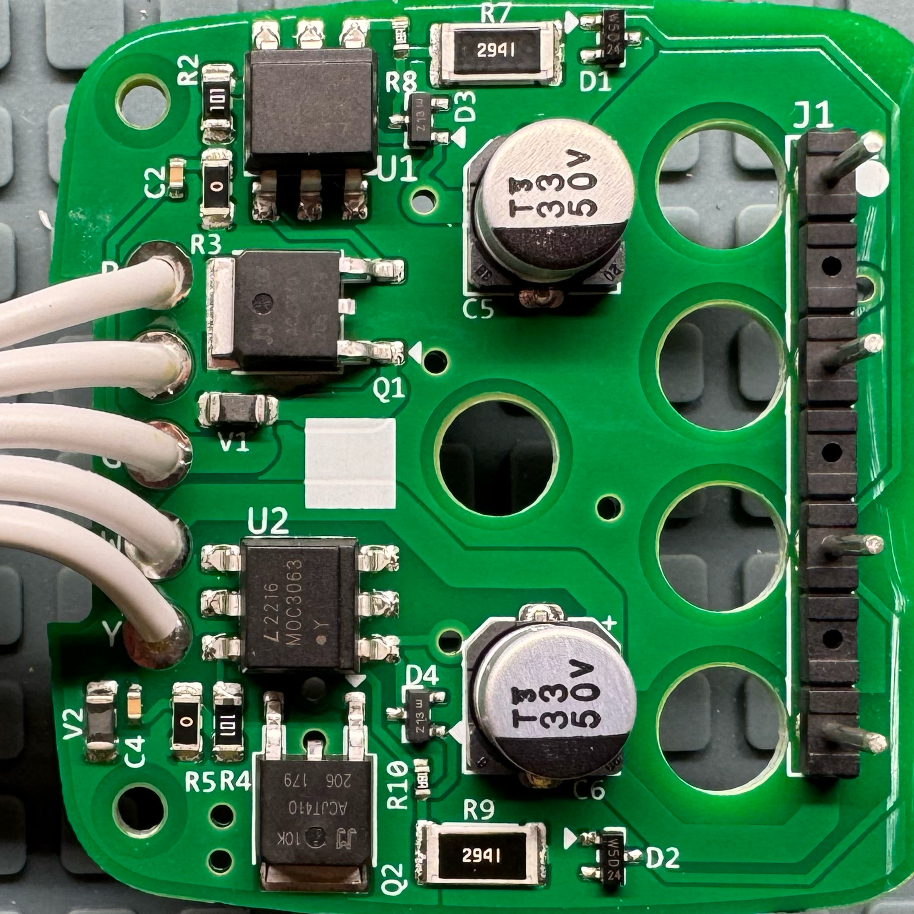
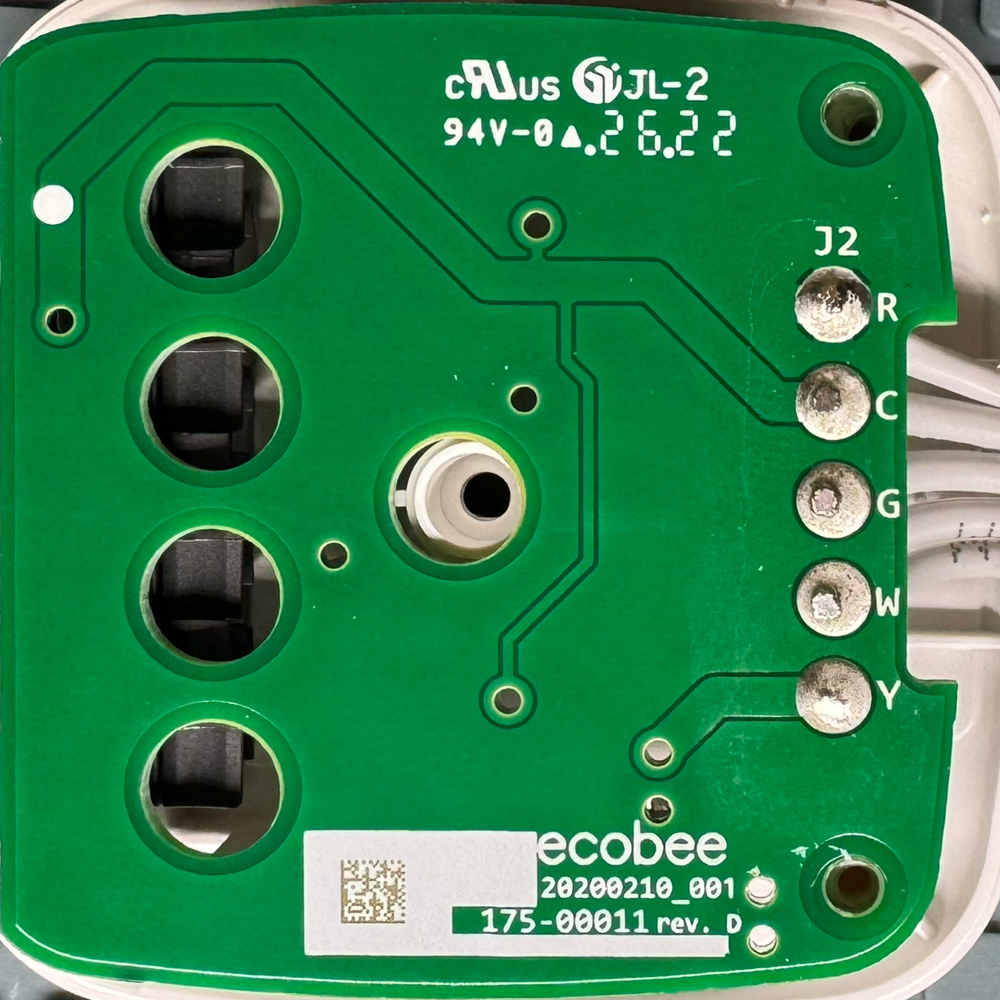
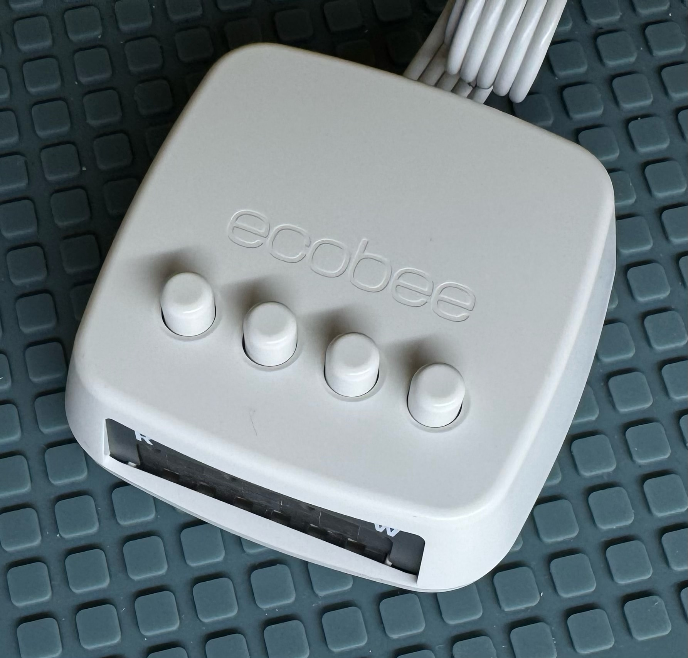

# EcoBee power extender kit teardown

This is a teardown and electrical analysis of a power extender kit used by EcoBee
with their smart thermostats.

## History

Smart thermostats require constant power. But the older thermostats they replace may
have been simple dumb devices with no use for a power supply. The thermostats may
have been completely electro-mechanical and only open or close a circuit to
activate heating or cooling. This did not provide power to the thermostat for its
own use.

### pre-Wi-Fi electronic thermostats

Many electronic thermostats solved this issue of a lack of constant power by
having a 9V battery in the thermostat
to supply continuous power. But later smart thermostats (with WiFi connectivity)
simply use too much energy for this to be a good solution.

### Nest’s Wi-Fi capable thermostat

Nest tried to solve this with an internal rechargeable battery and a tricky
circuit to allow the thermostat to charge slowly from the circuit when it is
open (no heating active). The difficulty with this is that when the heating
is active and the circuit is closed there is no power available. So the unit
must run from its battery
until the heating turns off. But if sufficient heat is required the heat will
run long enough that the battery in the unit runs down and it either must turn
off the heat. If it does not then it will power down due to low battery and that
opens the circuit also.

Also for some systems the trick circuit to draw a little power without presenting
a closed circuit to turn on the heat still draws enough current to cause the
heating system to see the circuit as closed and turn on constantly.

These two issues caused sufficient customer dissatisfaction for Nest such
as to create some quality perception problems in the public.

### EcoBee’s first Wi-Fi capable thermostat

EcoBee solved this in a different ways. Their first method was to put all the
smarts of the thermostat in a large box which was mounted by the HVAC system.
Due to its proximity this box could be connected to the HVAC with many wires,
sufficient to include two wires for power and multiple signal wires for heating,
cooling, fan, etc. This system required 4 wires in the wall to the thermostat
and send power over two, with two-way communications over the other two. The
thermostat was little more than a remote control, display and temperature
sensor.

### This solution

This teardown is of (what I believe to be) EcoBee's second method. This method
moves the smarts back into the wall thermostat. The issue then is that if
the wiring for the thermostat only has sufficient wires for control how
can the power be sent? So a solution is needed for systems which do not
provide constant power nor extra wires in the wall which can be used
to send constant power.

In a system with two circuits (three wires) in the wall it can send power
over two of the wires and control the two circuits using only the
third wire. This may be needed in a system which only has heat
and fan control. It is also shown as being able to send power
and control three circuits over the four wires in the wall. This is useful
for a system which heat, A/C and fan control.

They call this four-wire system their Power Extender Kit (PEK).

## Electrical background

In most home HVAC systems signaling is done with 24VAC (low voltage, rms) ladder
logic. There is a hot wire common across all circuits, often called
R. There are one or more other wires which are labeled with the
function they control. Connecting any one of these to the
common completes a circuit. Usually a closed circuit activates the function
although there are rare occasions where the logic is inverted and opening it
activates the function.

Electro-mechanical thermostats operate by presenting dry contacts to the circuit
wires. They close and open the contacts to complete and break the circuit to
turn the function on and off. Once there is more than one function and a common
hot is present they are not quite dry contacts anymore but still operated by
completing and opening circuits in the same way, just with a common hot wire on
one side of the contacts.

Any more recent thermostat has to largely mimic the functionality of these early
(heat only) to mid (heat plus fan or cool) 20th century thermostats. It is possible
to do this with relays. More recently using solid state relays or TRIACs became
the usual method.

## How it works

A normal connection is expressed as having the thermostat connected to the
(4) wires in the wall which are then connected to the HVAC system.

HVAC <-(x4 wall)-> thermostat

This system involves putting a demultiplexer between the HVAC and the wall
wires as well as connecting a 24VAC supply (C) from the HVAC to the demultiplexer
(PEK). This can be done as the PEK is located adjacent (often inside) the HVAC
and so additional wiring can be easily added. It requires a source of constant
power return (C) in the HVAC system, but one is always available. It available
on a terminal in any HVAC system made for decades now. The wiring then
looks like this:

HVAC <-(x5 closet)-> PEK <-(x4 wall)-> thermostat

The thermostat also incorporates a corresponding multiplexer function and
so the wiring with ladder logic at each end can be thought of like this:

HVAC <-(x5 closet)-> PEK <-(x4 wall)-> KEP <-(x5 virtual)-> thermostat

Although there is no separate KEP nor 5 wire bundle on the thermostat end.

## PEK operation

The first obvious thing when looking at the schematic is that the third circuit
labelled COOL here (but can be used for anything) is not involved in any way.
It's not clear why it is even part of the PEK. It does physically simplify
the wiring on the HVAC end by bringing the wall wires to a single spot in
a standard 4-wall wire installation.

Because of this the system operates as a 3 wire to 4 wire demultiplexer and any
extra wires are passed around the circuity.
The manual even implies that a system with
even more control wires but no C wire could be wired by simply running the
additional control wires in parallel to these multiplexed wires.
It is very difficult to
envision a system with more than 3 control wires (FAN, HEAT, COOL) but no C
wire.

Aside from any uninvolved wires the system is extracting two power wires (H, C)
and two control signals (G, Y) from three wires (H, C, PEK). H and C are used
but unmodified so it simply squeezes G and Y on a single wire PEK.

For G and Y any AC signal at all activates the function. But on PEK the presence
of positive voltages turns on G (FAN) and negative voltages turns on Y (HEAT).
Presenting no voltage at all turns off G and Y. Presenting a full AC signal turns
on G and Y. Presenting just the positive half of an AC signal (positive half-wave
rectification) turns on only G and presenting just the negative half (negative
half-wave rectification) turns on only Y. PEK has 4 states (no signal, AC,
positive half, negative half) and each presents one of
the 4 possible combinations of outputs (OFF/OFF, ON/ON, ON/OFF, OFF/ON).

# circuit analysis

[View schematic as a PDF here.](circuit-schematic.pdf)

With PEK entering on the left and G and Y exiting on the right the circuitry
can be divided into 4 quadrants. The bottom half mirrors the top, doing everything
the same as the top but for negative voltages. The top is the G circuitry and
the bottom is the Y circuitry.

The left and right are divided by U1 and U2. The left half circuitry decodes the
PEK signal
and the right half generates ladder logic AC signals from the decoded states.

Examining the top left quadrant, D1 rectifies the PEK signal so the positive-going
humps of the sine wave can charge C1 but cannot discharge it. The negative-going
humps are not passed at all, leaving a 1/120th of a second of zero voltage between
humps. At any time C1 will be approximately at the same voltage as the peak positive
voltage on PEK although this will diminish over time as C1 discharges. This variation
is called ripple and is common in power supplies that produce DC from rectified AC.
This voltage on the top produces a current out through R7 and R8 and then through
the emitter diode in U1. If sufficient current is produced in the emitter in U1
then U1 is activated, indicating that the corresponding output AC signal (G) should
be activated. D3 serves to limit the voltage across the U1 emitter and hence the
current induced in the U1 emitter. This protects the emitter from destruction by
overcurrent. R7 limits the current through D3 when it conducts. The bottom half
circuitry does the same to produce a current in the U2 emitter
indicating Y should be activated.

Examining the top right quadrant, U1 is an optocoupler which passes current between
pins 4 and 6 when the emitter is lit. The power provided to pin 6 of U1 is AC from
the input AC. U1 includes zero-crossing detection so it will
delay turning on until the voltage between 4 and 6 is minimal. This is best for AC
control of resistive loads as the inrush current produced when U1 turns on will be
minimized since the voltage is minimal. U1 turns on TRIAC Q1. It then conducts
input to output and this presents a ladder logic AC signal on G. Q1 will stay
on until the input signal is low and the current through Q1 drops to below its hold
current. As the load is resistive this means Q1 will turn off at a zero crossing.
C2 serves to snub the transients produced by U1 turning on and off. V1 is some form
of circuit protection against overvoltages. Although the datasheet for Q1
says it contains
its own TVS protection. The bottom right quadrant works the same as the top right
only for W.

## Meta-analysis

This seems like good circuitry. The unit is made well and the design is flexible
and robust. The circuit presents all possible modes with the only limitation being
that the output modes cannot be changed more rapidly than perhaps 10 times a second.
This is more than sufficient fidelity for HVAC control. The circuitry cannot deal
with DC as neither zero-crossing optocouplers nor TRIACs can operate to control
voltage which does not periodically return to zero. Low control voltage could put
the control out of spec due to supply ripple although the optocoupler turning on
below the indicated spec current (5mA) would likely hide this. Latching of the
TRIAC could also hide this.

The presence of the box could confuse anyone looking to change thermostats later.
They would have to figure out to look inside the HVAC system to find the PEK box
and remove it.

The box is well made and includes a nice sheet magnet on it for
attaching to the inside of a furnace. The spring connectors are actuated well.
The labeling for the wire entry is pretty good.

It would be possible to run an old system which has only R, G and W wires using
this but the first 3 terminals must always be used and they are labeled R, G and Y.
Is it possible the most common 3-wire no C system is a system with only fan and
cooling settings? The wiring for an R, G, W system would require putting the W
wire in the Y terminal socket despite the presence of a W socket.

### teardown images

